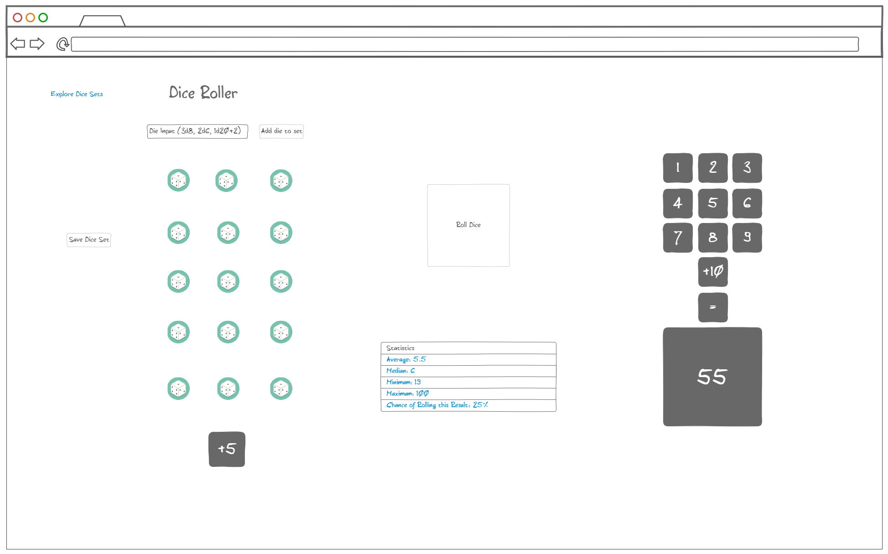
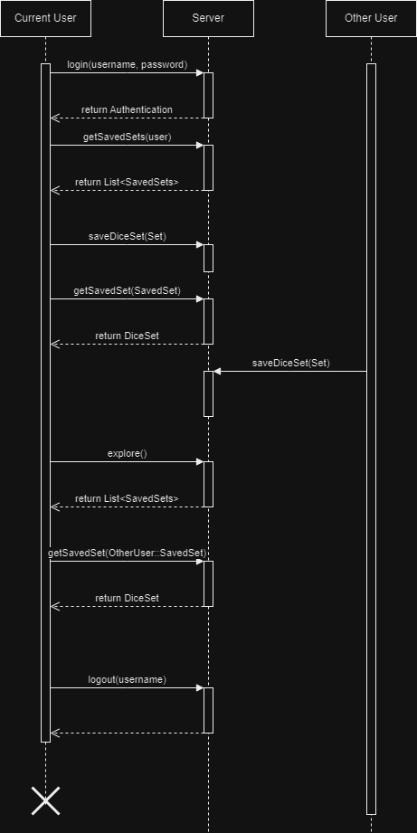

# startup
Link to my Notes page: [Notes](https://github.com/ejlayton00/startup/blob/main/notes.md)


## Startup Specification
### The Pitch
Have you ever rolled some dice and were amazed by the result? Maybe you wanted to share it with all your friends? Or maybe you were interested in the chance of rolling 17 on 3d6? The Dice Roller allows you to create an account where you can save sets of dice (3d6, 4d12, 10d10, 3d4+1d12, whatever you want). With these dice sets, you can roll them, getting an instant result (which you can share with your friends and show how (un)lucky you were), or you can look at the statistics of the dice set, and you can see just how lucky you were to get that high number. Once you're done with your own dice sets, you can look at what other people have rolled and the statistics that go along with their dice sets.

### Design


### How it Works


### Features
You will be able to:
- Login over a secure HTTPS connection
- Create sets of dice
- Roll those dice
- View statistics of dice (average, median, percent of rolling a specific number)
- Save sets of dice to your profile so you can edit or roll them later
- View and roll other users' saved dice sets

### Technologies
The following technologies will be used in this project.
- HTML -- The Dice Roller will use HTML to correctly and accurately structure the application.
    - Register/Login page
    - Dice Viewer/Editor page to view, roll, and edit dice sets
    - Explore page to look at dice sets that other people have made
- CSS -- The Dice Roller will use CSS to style and make it look good by using good whitespace and color choice
- JavaScript -- The Dice Roller will use JavaScript to login/register, roll and create dice sets, save dice sets, create statistics, and for backend database calls
- Service -- The backend endpoints will be:
    - Login/Register
    - Retrieving saved dice sets
    - Saving dice sets
- Database -- The database for Dice Roller will store the users and dice sets to those users
- Login/Register -- Users will not be able to save dice sets without being authenticated
- Users -- User information will be confidentially and securely saved in the database
- WebSocket -- As soon as a dice set is saved, it will be available to all other users
- React -- Eventually the application will be ported to use React

### HTML Deliverable
- Added DiceRoller, Explore, and Home/Index pages.
- Home/Index page includes a mock up of Login and Sign Up functionality. To get to the rest of the application, one must enter all the information, then select "Login" or "Sign Up" buttons.
    - Currently, the information must be included, but is not checked. Enter any value (besides nothing/null) to get access to the other pages.
- Created a menu, where a user can go to Explore or DiceRoller, or logout (which will take them to the login/signup page).
    - Above this menu is the current logged-in user.
- DiceRoller shows a mock up of what the page will look like when selecting dice, rolling dice, viewing statistics, and saving the dice sets.
    - All buttons do not work yet and are just placeholder.
    - All inputs for the dice check all input so that it will be correct for the application.
    - Added images for all the dice and their variations (i.e., d20 has 1, 2, 3, ..., 18, 19, 20).
- Explore page has a mock up of what the saved dice sets will show when they are saved this way.
    - This includes: user who saved the set, time saved (sorted by date), and a brief overview of the set.
    - "View Dice Set" currently takes the user to DiceRoller, but will (in the future) load the chosen dice set.

### CSS Deliverable
- Formatted all headers, footers, and main content body.
- Changed color and look of all buttons and links.
- Made sizes of items responsive.
- Added contrast through blacks, whites, and greys to many things.
- Made sure images won't cause problems with resizing, grids, and columns.
- Removed many "spacing" elements used in html files that are no longer needed (```<br>``` and ```<hr>``` elements).

### JavaScript Deliverable
- Added login and signup features (currently do nothing, but will send websocket data).
    - Login and Signup are now on separate mini-pages for ease of use.
- Created DiceSet class to hold all information needed for rolling, loading, saving, etc.
- Added all dice rolling features (rolling, statistics, etc.).
- Added loading dice sets from explore page into rolling page.
- Added a way to load a dice set into the explore page (for future database and websocket use).
- Added stubs for saving dice sets (which will go to future database and websocket).
- Removed "median" statistic (was not interesting, needed, or helpful in any scenario).
- Renamed "Chance of Roll" statistic to "Chance of Rolling Higher than Current Roll" for more interesting details.

### Service
- Added index.js to function as node.js server
- Frontend is now static middleware
- Added a quick picsum photo generator to the login page
    - This is a call to a third party endpoint
- Added /loadsets and /saveset endpoints to manage saving and loading dice sets
- All endpoints managed using fetch